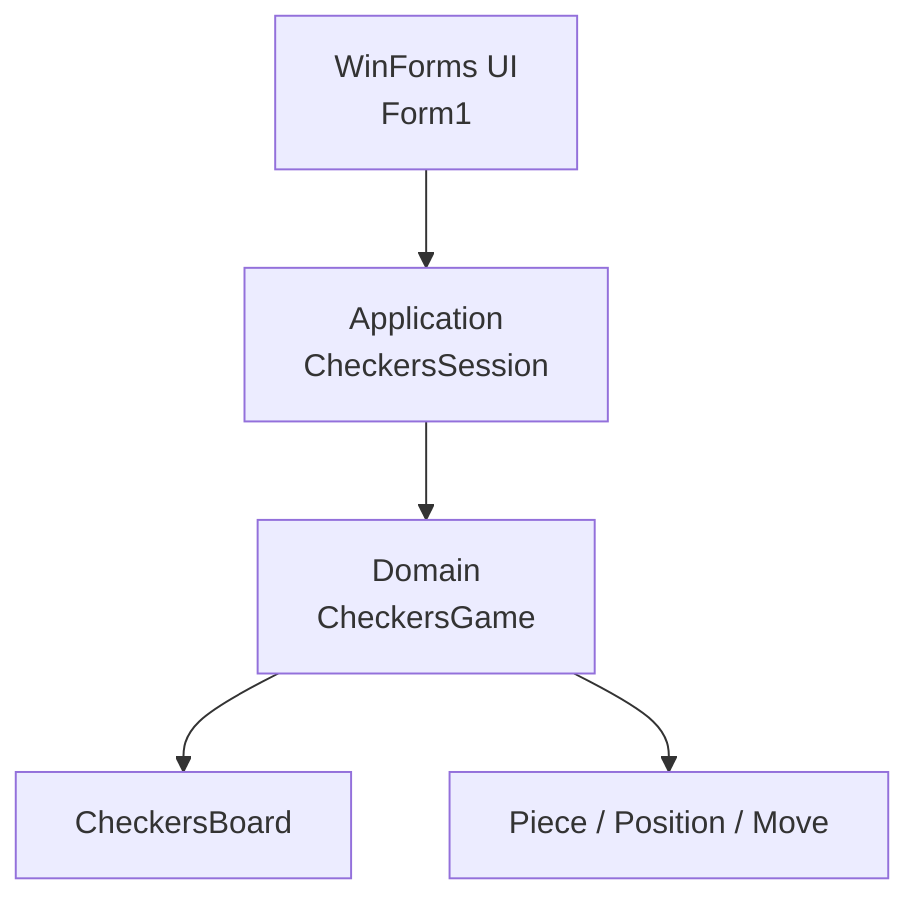

# Checkers Game (WinForms, C#)

Классическая игра в шашки на WinForms с разделением на UI, application-слой и доменный движок правил.

## Ключевые изменения

- Вынесены правила игры в отдельный доменный слой (`Game`).
- Добавлен application-слой (`CheckersSession`) для UI-сценария:
  - выбор фигуры;
  - статусы хода;
  - подсветка доступных действий;
  - управление forced-capture flow.
- `Form1` работает как thin adapter: принимает клик, запрашивает `BoardPresentation`, рисует состояние.
- Добавлены тесты на:
  - доменные правила (`CheckersGame`);
  - application-сценарии (`CheckersSession`).

## Архитектура



Подробный архитектурный документ: `docs/ARCHITECTURE.md`.

## Структура проекта

- `WinFormsApp11/Form1.cs` - UI-адаптер и рендеринг.
- `WinFormsApp11/Application/CheckersSession.cs` - оркестрация UI-сценариев.
- `WinFormsApp11/Application/BoardPresentation.cs` - модель состояния экрана.
- `WinFormsApp11/Application/CellPresentation.cs` - модель отдельной клетки для UI.
- `WinFormsApp11/Game/CheckersGame.cs` - движок правил.
- `WinFormsApp11/Game/CheckersBoard.cs` - состояние доски.
- `WinFormsApp11/Game/Piece*.cs`, `Position.cs`, `Move.cs` - базовые доменные типы.
- `WinFormsApp11/WinFormsApp11.Tests/*.cs` - тесты.

## Поддерживаемые правила

- Доска 8x8, классическая стартовая расстановка.
- Обычные шашки и дамки.
- Обязательное взятие.
- Серия взятий одной фигурой за один ход.
- Превращение в дамку.
- Определение победы по отсутствию фигур или ходов у соперника.

## Запуск

```powershell
dotnet build WinFormsApp11/WinFormsApp11.sln
dotnet run --project WinFormsApp11/WinFormsApp11.csproj
```

## Тесты

```powershell
dotnet test WinFormsApp11/WinFormsApp11.sln
```

## Дорожная карта

- История ходов + `Undo`.
- Профили правил (русские/английские/международные).
- AI-игрок (minimax + эвристики).
- Сохранение/загрузка позиции.
- Онлайн-режим (через отдельный transport adapter).
