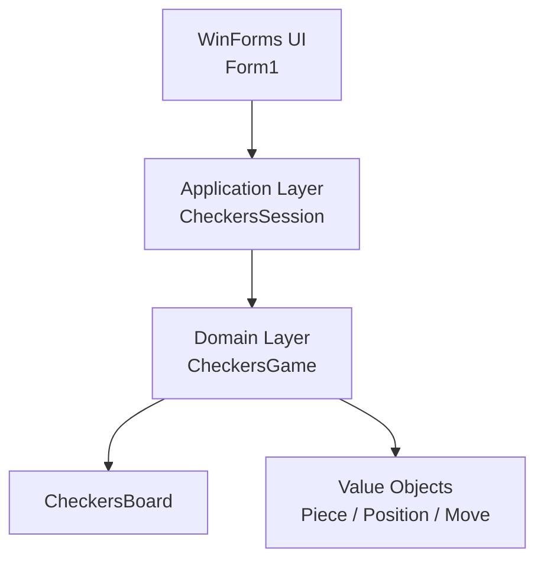
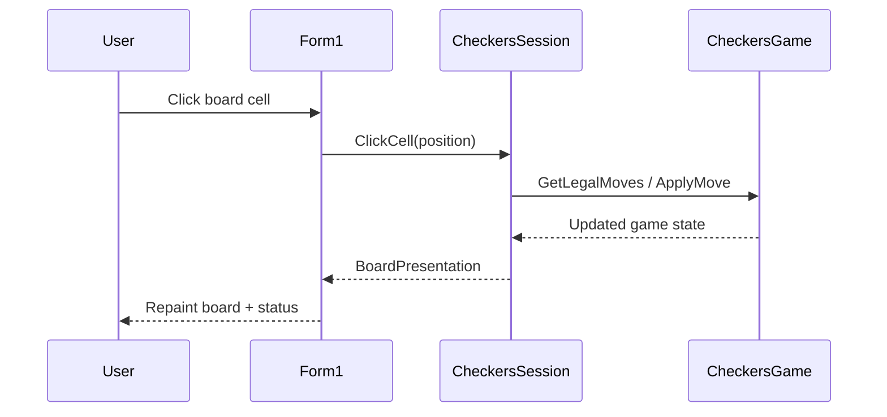

# Architecture

## Layered view

## Responsibilities

- `Form1`: input/output adapter. Handles click events and paints current presentation state.
- `CheckersSession`: UI use-case coordinator. Tracks selection, status text, and presentation model.
- `CheckersGame`: rule engine. Validates moves, enforces mandatory captures, multi-capture, promotion, and winner detection.
- `CheckersBoard`: board state storage and piece enumeration.
- `Piece`, `Position`, `Move`: immutable domain model types used across layers.

## Runtime interaction

## Extension points

- Rules variants: add strategy layer over `CheckersGame` move-generation methods.
- AI: add application service that evaluates `CheckersGame` legal moves and picks best move.
- Persistence: add board serialization/deserialization adapter in application layer.
- Multiplayer/network: replace local click source with command stream while keeping domain unchanged.
